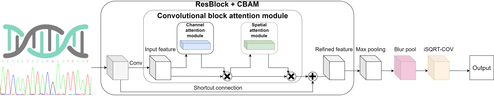

# Tracing the genealogy origin of geographic populations based on genomic variation and deep learning (TraceNet)

[comment]: <> (![This is Pic]&#40;TraceNet.png "Magic Gardens"&#41;)

<p align="center">
  
</p>

## Introduction

* Deep learning method can accurately identify the genealogy origin of query individuals at both subspecies and geographic population levels.
* Our model is also computationally efficient, which is over 300,000 times faster than the tree-based methods.
* We have developed a pipeline for explaining the importance score of key sites for deep learning algorithm interpretability and credibility, which has been largely ignored.
* We explored how to process data and adjust model parameters to achieve optimal accuracy when deep learning is applied to genomic big data.
* By coupling genomics and deep learning, our method will see broad potential in conservation and management applications that involve natural resources, invasive pests and weeds, and illegal trades of wildlife products.

>***Abstract***
> 
>Assigning a query individual animal or plant to its derived population is a prime task in diverse applications related to organismal genealogy. Such endeavors have conventionally relied on short DNA sequences under a phylogenetic framework. These methods naturally show constraints when the inferred population sources are ambiguously phylogenetically structured, a scenario demanding substantially more informative genetic signals. Recent advances in cost-effective production of whole-genome sequences and artificial intelligence have created an unprecedented opportunity to trace the population origin for essentially any given individual, as long as the genome reference data are comprehensive and standardized. Here, we developed a convolutional neural network method using genomic SNPs to identify population origins. Large-scale whole-genome sequences representing natural populations of the Asian honeybee Apis cerana, at both subspecies and geographic population levels, are used for the proof of concepts. A proportion of the genomic data was used as query sequences to be compared against the reference, and the results indicate that our method can accurately identify the genealogy origin of query individuals at both subspecies and geographic population levels, with >98% success rates. Our model is also computationally efficient, which is over 300,000 times faster than the tree-based methods. We further showed that the accuracy of the model can be significantly increased by refining the informative sites through F_{ST} filtering. Our method is robust to configurations related to batch sizes and epochs, whereas model learning benefits from the setting of a proper preset learning rate. Moreover, we also attempt to explain the importance score of key sites for algorithm interpretability and credibility, which has been largely ignored. We anticipate that by coupling genomics and deep learning, our method will see broad potential in conservation and management applications that involve natural resources, invasive pests and weeds, and illegal trades of wildlife products.

### Installation (You can install it through conda or mamba):
* `conda env create -f TraceNet.yaml`
* or `mamba env create -f TraceNet.yaml` Mamba is much faster than Conda installation environment!

### Data preprocess:
- Using the [VCFTools](https://vcftools.github.io/index.html) tool to filter SNPs based on F<sub>st</sub> values:
  
- Converting VCF files to fasta format using the [vcf2phylip](https://github.com/edgardomortiz/vcf2phylip) script (see `example.fasta`)

- Building the following CSV table (see `SpeciesName2Label.csv`) for generating the dataset. SampleID corresponds to the name of each sequence in the fasta file, and Label corresponds to different genealogy origins (corresponding to City/Country here):


| **State/Province** | **City/County** | **Subspecies**      | **SampleID** | **Label** |
|:------------------:|:---------------:|:-------------------:|:------------:|:---------:|
| Yunnan             | Lushui          | Apis cerana cerana  | B320         | 0         |
| Yunnan             | Lushui          | Apis cerana cerana  | B321         | 0         |
| Yunnan             | Lushui          | Apis cerana cerana  | B322         | 0         |
| Yunnan             | Lushui          | Apis cerana cerana  | B323         | 0         |
| Yunnan             | Lushui          | Apis cerana cerana  | B324         | 0         |
| Yunnan             | Nvjiang         | Apis cerana cerana  | B359         | 1         |
| Yunnan             | Nvjiang         | Apis cerana cerana  | B358         | 1         |
| Yunnan             | Nvjiang         | Apis cerana cerana  | B355         | 1         |
| Yunnan             | Nvjiang         | Apis cerana cerana  | B318         | 1         |
| Yunnan             | Nvjiang         | Apis cerana cerana  | B317         | 1         |
| Yunnan             | Nvjiang         | Apis cerana cerana  | B316         | 1         |
| Yunnan             | Nvjiang         | Apis cerana cerana  | B360         | 1         |
| Yunnan             | Nvjiang         | Apis cerana cerana  | B354         | 1         |
| Yunnan             | Xishaungbanna   | Apis cerana cerana  | B313         | 2         |
| Yunnan             | Xishaungbanna   | Apis cerana cerana  | B314         | 2         |
| Yunnan             | Xishaungbanna   | Apis cerana cerana  | B312         | 2         |
| Yunnan             | Xishaungbanna   | Apis cerana cerana  | B351         | 2         |
| Yunnan             | Xishaungbanna   | Apis cerana cerana  | B353         | 2         |
| Yunnan             | Xishaungbanna   | Apis cerana cerana  | B349         | 2         |
| Yunnan             | Xishaungbanna   | Apis cerana cerana  | B348         | 2         |
| Yunnan             | Xishaungbanna   | Apis cerana cerana  | B347         | 2         |
| Yunnan             | Xishaungbanna   | Apis cerana cerana  | B352         | 2         |
| Yunnan             | Xishaungbanna   | Apis cerana cerana  | B350         | 2         |


- Then running the script `ConvertFasta2Dataset.py` will obtain the dataset files (see `example_data.pt` and `example_label.pt`)

### Usage:
To test our algorithm, please follow these steps (tested on Ubuntu 18.04):

1 . Modify the `main.py` file in the directory (Set the path of training database and adjust hyperparameters according to your server). After you have modified the `main.py` file, please run the code as follows.

(Note: 0, 1, 2 use graphics cards No. 0, No. 1 and No. 2.
If you run **python train.sh** directly, you use all graphics cards by default.)
```console
CUDA_VISIBLE_DEVICES=0,1,2 python main.py
```

2 . The final result will be saved in the `Output` folder.

3 . The training logs are saved in the `runs` folder and can be viewed through `Tensorboard`.


